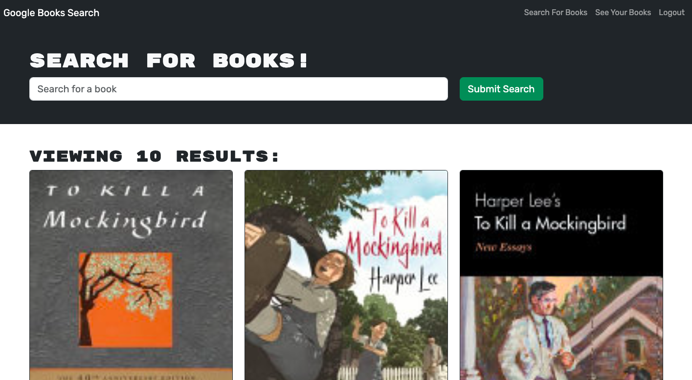
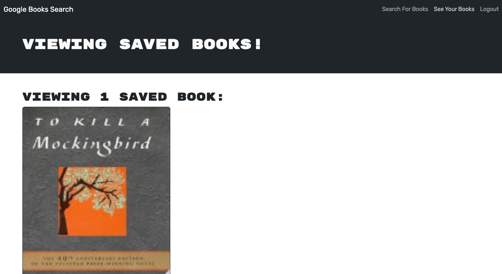

# Book Search App

## Description

This app uses the Google Books API to be able to search for and find books. You can save any that interest you to your profile account.

## Table of Contents
* [Installation](#installation)
* [Contribution](#contribution)
* [Screenshots](#screenshots)
* [Links](#links)

## Installation

To be able to install the project, the following is needed to install packages and/or dependencies:
~~~
npm i
~~~

## Contribution

Starter code was provided by UNC Full Stack Coding Bootcamp where the app was completed as a RESTful application, so anicrob's job was to turn this into an app that uses GraphQL instead with minor troubleshooting assistance from learning assistants at UNC.

## Screenshots:

Search Books Page

Saved Books Page

## Links

Repo: https://github.com/anicrob/book-search-app

Deployed Application: https://google-search-book-84760526c640.herokuapp.com/
